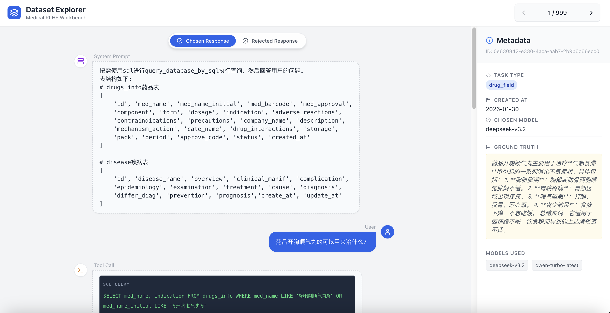

# DPO 训练 Agent 项目

使用 DPO（Direct Preference Optimization）方法训练医疗领域 Agent 的完整流程。

## 目录

- [项目概述](#项目概述)
- [准备工作](#准备工作)
- [一、构造训练数据集](#一构造训练数据集)
- [二、训练模型](#二训练模型)
- [三、测试与验证](#三测试与验证)

---

## 项目概述

本项目通过 DPO 方法训练一个基于数据库查询的医疗 Agent。

### 核心思路

准备两个模型（一个表现好、一个表现差），让 DPO 学习两者的偏好差异，从而提升模型回答质量。

### 技术栈

| 组件 | 技术 |
|------|------|
| Agent 框架 | Google ADK |
| 训练框架 | ms-swift (ModelScope) |
| 数据库 | SQLite |
| LLM 服务 | vLLM |

---

## 准备工作

### Git LFS 配置

本项目使用 Git LFS 管理大文件数据，需要先安装并配置 LFS：

```bash
# 1. 安装 Git LFS
brew install git-lfs  # macOS
# 或 sudo apt-get install git-lfs  # Ubuntu/Debian

# 2. 初始化 LFS
git lfs install

# 3. 克隆仓库后，拉取 LFS 文件
git lfs pull
```

**LFS 管理的文件**：
| 文件 | 说明 | 大小 |
|------|------|------|
| `DPO/data/dpo_dataset.jsonl` | DPO 训练数据集 | ~16MB |
| `DPO/data/medical_data.db` | 医疗数据库 | ~356MB |

### 环境配置

```bash
cp DPO/data/env_template DPO/data/.env
```

---

## 一、构造训练数据集

### 1. 数据源

- **数据库**: `DPO/data/medical_data.db` (约 356MB)
- **包含表**:

| 表名 | 说明 |
|------|------|
| `drugs_info` | 药品信息表 |
| `disease` | 疾病信息表 |

**drugs_info 表结构**:
```python
[
    'id', 'med_name', 'med_name_initial', 'med_barcode', 'med_approval',
    'component', 'form', 'dosage', 'indication', 'adverse_reactions',
    'contraindications', 'precautions', 'company_name', 'description',
    'mechanism_action', 'cate_name', 'drug_interactions', 'storage',
    'pack', 'period', 'approve_code', 'status', 'created_at'
]
```

**disease 表结构**:
```python
[
    'id', 'disease_name', 'overview', 'clinical_manif', 'complication',
    'epidemiology', 'examination', 'treatment', 'cause', 'diagnosis',
    'differ_diag', 'prevention', 'prognosis', 'create_at', 'update_at'
]
```

### 2. Agent 架构

使用 Google ADK 框架构建 Agent，相关文件:

| 文件 | 说明 |
|------|------|
| `DPO/data/main_api.py` | API 入口 |
| `DPO/data/create_model.py` | 模型配置 |
| `DPO/data/agent.py` | Agent 核心逻辑 |
| `DPO/data/prompt.py` / `DPO/qa_prompt.txt` | 提示词 |
| `DPO/data/memory_controller.py` | 记忆管理 |
| `DPO/data/adk_agent_executor.py` | ADK 执行器 |
| `DPO/data/tools.py` | 数据库查询工具 |

**工作流程**: Agent 根据 prompt 使用 `query_database_by_sql` 工具查询数据库。

### 3. 数据生成流程

```
┌─────────────────┐    ┌─────────────────┐    ┌─────────────────┐
│ generate_questions │ -> │ generate_dpo    │ -> │ filter_dpo      │
│ 生成问答数据     │    │ 生成DPO数据集   │    │ 过滤低质数据    │
│ qa_dataset.jsonl │    │ dpo_dataset.jsonl│   │ filter_xxx.jsonl│
└─────────────────┘    └─────────────────┘    └─────────────────┘
```

#### 步骤 3.1: 生成问答数据

```bash
cd DPO/data
python generate_questions.py
# 输出: qa_dataset.jsonl
```

#### 步骤 3.2: 生成 DPO 数据集

```bash
python generate_dpo.py
# 输出: dpo_dataset.jsonl
```

#### 步骤 3.3: 数据集分析

```bash
python analyze_dpo_dataset.py
```

**分析报告摘要**:

| 指标 | 数值 |
|------|------|
| 总样本数 | 999 |
| 平均消息长度 | 2802.80 |
| 中位数长度 | 472.00 |
| 推荐 max_length | 4096 |

**任务类型分布**:
- `disease_field`: 304 (30.43%)
- `drug_field`: 298 (29.83%)
- `compare_diseases`: 150 (15.02%)
- `compare_drugs`: 147 (14.71%)
- `drug_search_by_kw`: 100 (10.01%)

**Chosen 模型分布**:
- `deepseek-v3.2`: 944 (94.49%)
- `Qwen/Qwen2.5-7B-Instruct`: 37 (3.70%)
- `qwen-turbo-latest`: 18 (1.80%)

#### 步骤 3.4: 数据可视化

启动前端可视化服务查看数据分布:

```bash
# 终端1: 启动后端 API
cd DPO/data
python main_data_api.py

# 终端2: 启动前端
cd DPO/data/rlhf-data-explorer
npm run dev
```



#### 步骤 3.5: 数据过滤

```bash
python filter_dpo.py
# 输出: filter_dpo_dataset.jsonl
```

---

## 二、训练模型

### 1. 环境准备

#### 获取 Docker 镜像

```bash
docker pull modelscope-registry.cn-beijing.cr.aliyuncs.com/modelscope-repo/modelscope:ubuntu22.04-cuda12.6.3-py311-torch2.7.1-vllm0.10.1.1-modelscope1.29.2-swift3.8.1
```

#### 创建容器

```bash
docker create \
  --runtime=nvidia --gpus all --net=host \
  --shm-size="10g" --cap-add=SYS_ADMIN \
  -v "$(pwd)":/workspace/DPO_TRAIN_AGENT \
  -v "$HOME/.cache":/root/.cache \
  -v /etc/localtime:/etc/localtime:ro \
  -v /etc/timezone:/etc/timezone:ro \
  --name swift \
  modelscope-registry.cn-beijing.cr.aliyuncs.com/modelscope-repo/modelscope:ubuntu22.04-cuda12.6.3-py311-torch2.7.1-vllm0.10.1.1-modelscope1.29.2-swift3.8.1 \
  sleep infinity
```

**指定 GPU** (如只使用显卡 1):
```bash
--gpus "device=1"
```

#### 启动容器

```bash
docker start swift
docker exec -it swift bash
```

### 2. 登录监控平台

```bash
export WANDB_BASE_URL=http://xxx:3005
export WANDB_API_KEY=local-xxx
wandb login
swanlab login -k sxxxx
```

### 3. 开始训练

```bash
cd DPO
bash train_task1_2_lora.sh
```

### 4. 合并模型

```bash
swift export \
    --adapters output/task1_2_lora/v2-20260202-134851/checkpoint-60 \
    --merge_lora true \
    --output_dir local_dpo_agent
```

**输出模型结构**:
```
local_dpo_agent/
├── added_tokens.json
├── args.json
├── chat_template.jinja
├── config.json
├── generation_config.json
├── merges.txt
├── model-00001-of-00004.safetensors
├── model-00002-of-00004.safetensors
├── model-00003-of-00004.safetensors
├── model-00004-of-00004.safetensors
├── model.safetensors.index.json
├── model.safetensors
├── special_tokens_map.json
├── tokenizer.json
├── tokenizer_config.json
└── vocab.json
```

### 5. 启动模型服务

```bash
bash start_vllm.sh
```

---

## 三、测试与验证

### 启动 Agent 测试服务

```bash
cd DPO/data
python main_api.py
```

### 客户端测试

```bash
python a2a_client.py
```

### 效果对比

| 维度 | 训练前模型 | 训练后模型 |
|------|-----------|-----------|
| SQL 查询 | `SELECT indication FROM drugs_info WHERE med_name = 'xxx'` | `SELECT * FROM drugs_info WHERE med_name = 'xxx'` |
| 回答长度 | 简短 (1-2句) | 详细 (多段落) |
| 信息丰富度 | 基本信息 | 包含用法用量、注意事项、药理作用等 |

**训练前回答示例**:
> 药品白葡奈氏菌片可以用来治疗慢性气管炎及喘息性气管炎。

**训练后回答示例**:
> 根据查询结果，药品"白葡奈氏菌片"的查询结果如下：
>
> ## 基本信息
> **药品名称**: 白葡奈氏菌片
> **剂型**: 薄膜衣片
> **规格**: 0.3mg
> ...
>
> ## 详细信息
> 1. **主要成分**: 白色葡萄球菌、奈瑟卡他球菌、枯草芽孢杆菌
> 2. **适应症**: 慢性气管炎及喘息性气管炎
> 3. **用法用量**: ...
> 4. **注意事项**: ...
> 5. **药理作用**: ...
> 6. **贮藏条件**: ...

---

## 训练结果可视化

训练日志保存在 `doc/trained_images/` 目录下:

| 图表 | 说明 |
|------|------|
| `train_loss.png` | 训练损失曲线 |
| `train_learning_rate.png` | 学习率变化 |
| `train_rewards_accuracies.png` | 奖励准确率 |
| `train_rewards_margins.png` | 奖励边界 |
| `train_grad_norm.png` | 梯度范数 |
| `train_total_flos.png` | 总计算量 |
| `train_logits_chosen.png` | chosen token 分布 |
| `train_logits_rejected.png` | rejected token 分布 |
| `train_logps_chosen.png` | chosen log概率 |
| `train_logps_rejected.png` | rejected log概率 |

## 📬 联系方式

如有问题，请联系作者：
